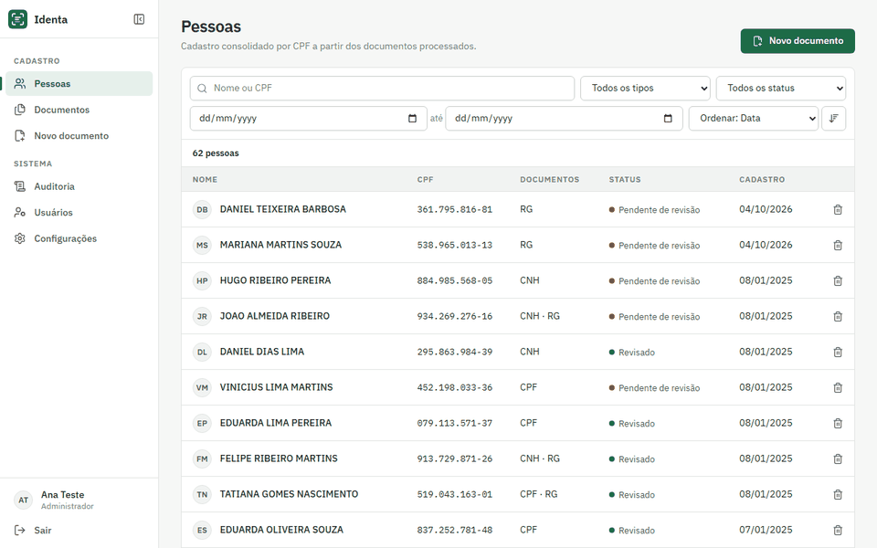
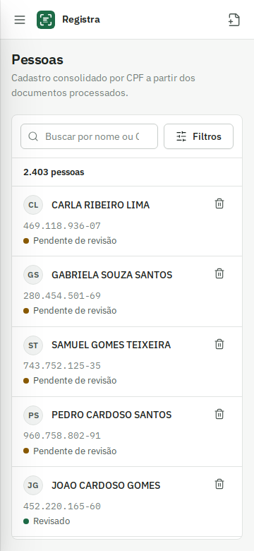
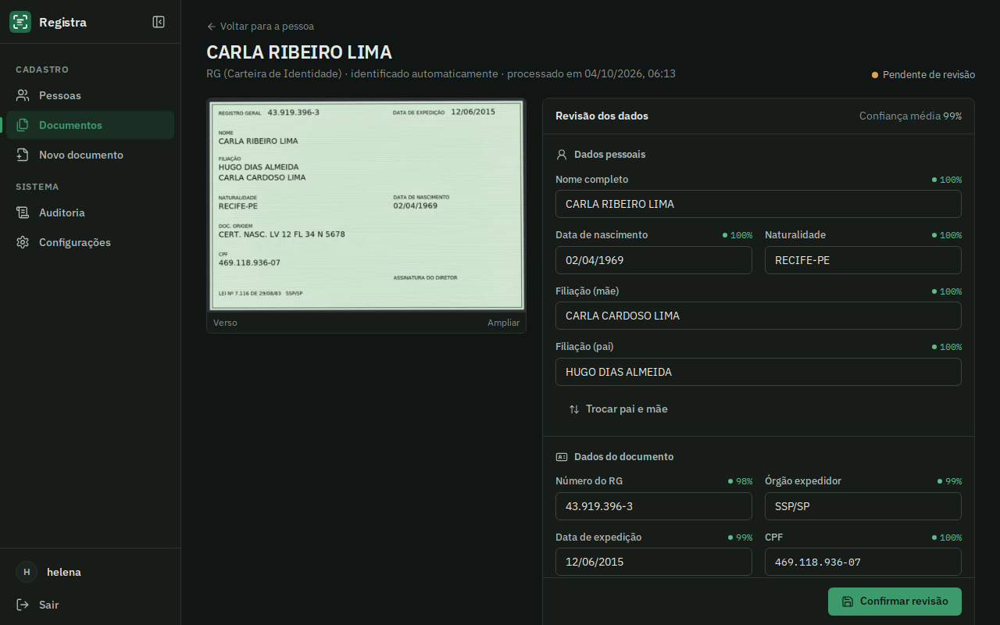
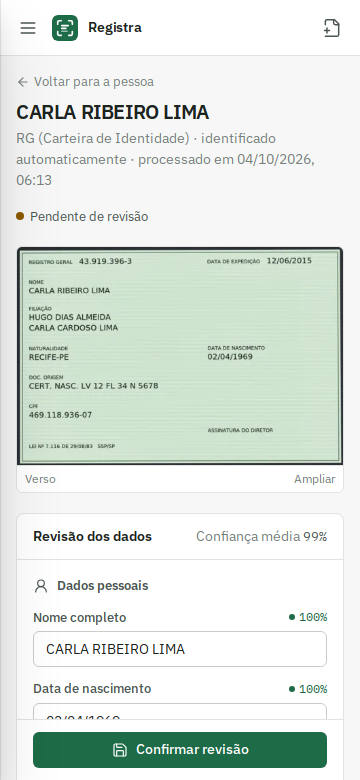
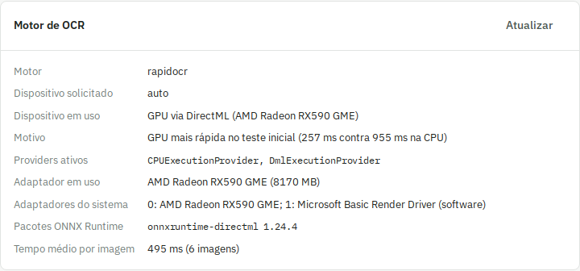

<p align="center">
  
</p>

<p align="center">
  Leitura de documentos de identidade brasileiros com revisão manual, rodando inteiramente no seu servidor.
</p>

<p align="center">
  
</p>

O Registra recebe a foto da frente e do verso de um RG, CNH ou cartão CPF, corrige perspectiva e orientação, extrai os campos com OCR, valida o que for possível e apresenta tudo para conferência antes de salvar. Os dados são consolidados por pessoa, deduplicados pelo CPF, prontos para alimentar fluxos de admissão ou cadastro de clientes.

Nenhuma imagem ou dado sai do servidor: o OCR roda localmente e os arquivos são gravados criptografados.

## Telas

| Desktop | Celular |
| --- | --- |
|  |  |
|  |  |
|  |  |

## Recursos

**Leitura**
- RG (modelos estaduais antigos e o modelo novo), CNH (incluindo a MRZ do verso) e cartão CPF
- Identificação automática do tipo de documento
- Correção de perspectiva, detecção de orientação e realce de contraste antes do OCR
- Leitura ancorada nos rótulos impressos, com cada lado do documento tratado separadamente
- Recorte automático de foto, assinatura e polegar
- Campos complementares do RG: DNI, título de eleitor, CTPS, NIS/PIS, CNS, CNH, registro civil e outros

**Validação**
- Dígito verificador do CPF, com nova leitura da região quando o valor não fecha
- Datas, coerência entre datas e campos obrigatórios por tipo de documento
- Confiança do OCR por campo, indicada na tela de revisão

**Cadastro**
- Pessoas consolidadas por CPF, com todos os documentos vinculados
- Busca por nome ou CPF, filtros por tipo, status e período, ordenação e paginação no servidor
- Filtros refletidos na URL, para compartilhar ou recarregar sem perder o contexto
- Exclusão completa de documento ou pessoa, com confirmação digitada para exclusões em lote
- Edição e verificação dos dados consolidados da pessoa, com os dados complementares de todos os documentos
- Link de envio remoto: gere um link de uso único e a própria pessoa envia frente e verso pelo celular
- Auditoria de todas as ações, inclusive visualizações, com IP, detalhes e horário no fuso configurado

**Segurança e privacidade (LGPD)**
- OCR local com RapidOCR (modelos PP-OCRv5 em ONNX), sem serviços externos, em CPU ou GPU
- Imagens originais, processadas e recortes criptografados com AES-256-GCM
- Login com senhas em argon2, sessão persistente com refresh token rotativo, lista de sessões ativas, limite de tentativas e proteção contra CSRF

**Interface**
- React com tema claro e escuro, navegação lateral recolhível e menu em gaveta no celular
- Atualização automática das listas quando documentos chegam de outro aparelho

## Requisitos

| | Mínimo | Recomendado |
| --- | --- | --- |
| Processador | x86-64 com 4 núcleos e suporte a AVX | 6 núcleos ou mais |
| Memória RAM | 4 GB livres (o OCR em CPU chegou a 1,6 GB de pico no benchmark) | 8 GB ou mais |
| Placa de vídeo | Não é necessária | GPU compatível com DirectML 12 (AMD, Intel ou NVIDIA) no Windows, ou NVIDIA com CUDA |
| Memória de vídeo | — | 2 GB ou mais (o OCR usou cerca de 1,1 GB de VRAM no benchmark) |
| Disco | 3 GB (imagem Docker de 1,5 GB, mais documentos) | 10 GB ou mais, conforme o volume de imagens guardadas |
| Python | 3.12 (sem Docker) | 3.12 |
| Sistema | Windows 10 build 18362 (1903) ou superior, ou Linux x86-64 | Windows 10 22H2 / Windows 11, ou Ubuntu 22.04+ |
| Docker | Docker Desktop com WSL2, ou Docker Engine + Compose v2 | — |

## Hardware testado

Valores medidos com `scripts/benchmark.py` nesta máquina, com imagens sintéticas de documento. Relatórios completos em [docs/benchmarks.md](docs/benchmarks.md) (Windows nativo, CPU e GPU) e [docs/benchmarks-docker.md](docs/benchmarks-docker.md) (Docker, só CPU).

| CPU | GPU | RAM | Sistema | Driver da GPU | Python | Tempo médio por imagem, CPU | Tempo médio por imagem, GPU |
| --- | --- | --- | --- | --- | --- | --- | --- |
| AMD Ryzen 5 1600 (6 núcleos / 12 threads) | AMD Radeon RX 590 GME, 8 GB | 19,9 GB | Windows 10 Pro 22H2, build 19045 | 31.0.21924.61 (Adrenalin 26.1.1) | 3.12.15 | 1.854 a 2.159 ms (nativo) · 1.772 a 2.107 ms (Docker) | 766 a 776 ms (DirectML, nativo) |

As faixas cobrem os lotes de 1, 8 e 32 imagens. Os tempos variam entre execuções conforme a carga do Windows: uma rodada anterior na mesma máquina mediu 2.527 a 3.032 ms na CPU e 574 a 734 ms na GPU. Em todas as rodadas e em todos os lotes a GPU foi mais rápida, de 2,4 a 5,2 vezes.

## Suporte a GPU

O OCR roda com ONNX Runtime e modelos PP-OCRv5 convertidos para ONNX (RapidOCR). A variável `GREEN_OCR_OCR_DEVICE` aceita:

- `auto` (padrão): testa a GPU na inicialização. Se ela não iniciar, se não houver VRAM suficiente ou se for mais lenta que a CPU num teste rápido, usa a CPU e registra o motivo no log e na tela de Configurações.
- `cpu`: sempre CPU.
- `gpu`: usa a GPU mesmo que a CPU seja mais rápida; se não houver GPU disponível, cai para a CPU e informa o motivo.

| Plataforma | Backend | Extra de instalação | Situação |
| --- | --- | --- | --- |
| AMD no Windows | DirectML | `.[gpu-directml]` | Testado na RX 590 (Polaris), driver 31.0.21924.61 |
| Intel no Windows | DirectML | `.[gpu-directml]` | Não testado; usa o mesmo caminho da AMD |
| NVIDIA no Windows | DirectML | `.[gpu-directml]` | Não testado; usa o mesmo caminho da AMD |
| NVIDIA no Linux ou Windows | CUDA | `.[gpu-cuda]` | Implementado e não testado (sem placa NVIDIA disponível) |
| AMD no Linux | ROCm | — | Não suportado; a RX 590 (Polaris) não é aceita pelas versões atuais do ROCm |
| Qualquer CPU x86-64 | CPU | `.[cpu]` | Testado, nativo no Windows e no Docker |
| Docker no Windows | CPU | imagem padrão | Testado. O Docker Desktop não repassa GPUs AMD ou Intel para o container, então o modo GPU roda nativo |

O motor alternativo é o Tesseract (`GREEN_OCR_OCR_ENGINE=tesseract`, extra `.[tesseract]` e o programa `tesseract` com o idioma `por`). Ele também é usado automaticamente quando o RapidOCR não consegue iniciar. A imagem Docker já traz o Tesseract instalado.

## Instalação no Windows sem Docker (com GPU)

1. Atualize o driver da placa de vídeo (AMD Software: Adrenalin Edition, Intel Arc/Iris ou NVIDIA).
2. Instale o Python 3.12 de [python.org](https://www.python.org/downloads/windows/) marcando "Add python.exe to PATH". Desative o atalho da Microsoft Store em *Configurações > Aplicativos > Aliases de execução do aplicativo* se `python` abrir a loja.
3. Instale o Node.js 22 LTS de [nodejs.org](https://nodejs.org/) (só para compilar a interface).
4. No PowerShell, dentro da pasta do projeto:

```powershell
python -m venv .venv-gpu
.\.venv-gpu\Scripts\Activate.ps1
python -m pip install --upgrade pip
pip install -e ".[gpu-directml,dev]"
copy .env.example .env
python -m app.cli generate-key
python -m app.cli generate-key
```

5. Cole as duas chaves geradas em `GREEN_OCR_ENCRYPTION_KEY` e `GREEN_OCR_SECRET_KEY` no `.env`.
6. Compile a interface, prepare o banco e crie o usuário:

```powershell
cd frontend
npm ci
npm run build
cd ..
python -m app.cli download-models
alembic upgrade head
python -m app.cli create-user admin
```

7. Suba o servidor:

```powershell
uvicorn app.main:create_app --factory --host 127.0.0.1 --port 8090
```

Para CPU sem GPU, troque `.[gpu-directml]` por `.[cpu]`. Para NVIDIA com CUDA, use `.[gpu-cuda]` e instale o CUDA e o cuDNN compatíveis com a versão do `onnxruntime-gpu`.

## Instalação com Docker (CPU)

Requisitos: Docker Desktop (Windows, com WSL2) ou Docker Engine com Compose v2 (Linux).

```bash
git clone <url-do-repositorio> registra
cd registra
cp .env.example .env
docker compose run --rm --no-deps app python -m app.cli generate-key
```

Preencha `GREEN_OCR_ENCRYPTION_KEY` e `GREEN_OCR_SECRET_KEY` no `.env` com chaves geradas, depois:

```bash
docker compose up -d --build app
docker compose exec app python -m app.cli create-user admin
```

A aplicação fica em `http://127.0.0.1:8090`. Para acessar de outros aparelhos da rede, defina `GREEN_OCR_BIND=0.0.0.0` no `.env`. Para expor na internet, coloque um proxy com HTTPS na frente. A imagem já vem com os modelos de OCR e o Tesseract, e roda sempre em CPU.

> Guarde a `GREEN_OCR_ENCRYPTION_KEY` em local seguro. Sem ela as imagens não podem ser lidas.

Para desenvolver a interface com recarga automática, rode `npm run dev` dentro de `frontend/`; as chamadas para `/api` são encaminhadas para a porta 8090.

## Como verificar se a GPU está sendo usada

- **Na interface:** em *Administração > Motor de OCR* aparecem o dispositivo em uso, o motivo da escolha, os providers ativos do ONNX Runtime, o adaptador de vídeo usado (e os demais adaptadores do sistema) e o tempo médio por leitura. Com a GPU ativa, os providers incluem `DmlExecutionProvider` e o adaptador é a placa dedicada.
- **No terminal:**

```powershell
python -m app.cli ocr-status
```

- **No log do servidor:** na inicialização aparece uma linha como `OCR em GPU via DirectML (AMD Radeon RX590 GME): GPU mais rápida no teste inicial (229 ms contra 908 ms na CPU)`.
- **No Gerenciador de Tarefas:** na aba *Desempenho*, a GPU dedicada mostra uso de "Compute" ou "3D" e memória dedicada ocupada enquanto documentos são processados.
- **Benchmark:** `python scripts/benchmark.py` mede CPU e GPU na sua máquina e grava `docs/benchmarks.md`.



## Solução de problemas

**Driver desatualizado.** Sintomas: o modo `auto` registra "falha ao iniciar a GPU" ou `DmlExecutionProvider` não aparece entre os providers. O DirectML exige driver com suporte a DirectX 12. Atualize pelo AMD Software (Adrenalin), Intel Driver & Support Assistant ou GeForce Experience, reinicie e confira com `python -m app.cli ocr-status`.

**Conflito entre `onnxruntime` e `onnxruntime-directml`.** Os dois pacotes instalam os mesmos arquivos e o último instalado sobrescreve o outro, o que pode fazer o DirectML sumir sem erro. O sistema detecta e mostra um aviso no `ocr-status`, no log e na tela de Configurações. Para corrigir, desinstale todos e reinstale apenas um extra:

```powershell
pip uninstall -y onnxruntime onnxruntime-directml onnxruntime-gpu
pip install -e ".[gpu-directml]"
```

Para voltar à CPU, troque o último comando por `pip install -e ".[cpu]"`.

**Falta de VRAM.** O OCR usou cerca de 1,1 GB de VRAM no benchmark. Se a placa tiver menos de 1 GB dedicado, o modo `auto` usa a CPU. Se outros programas ocuparem a VRAM (jogos, editores de vídeo), a inicialização pode falhar com erro de memória; o modo `auto` então cai para a CPU e registra o motivo. Feche os programas e reinicie o servidor, ou force `GREEN_OCR_OCR_DEVICE=cpu`.

**GPU integrada escolhida no lugar da dedicada.** O sistema lista os adaptadores pelo DXGI, descarta o renderizador de software da Microsoft e escolhe o adaptador com mais memória dedicada, que normalmente é a placa dedicada. Confira em *Adaptador em uso*. Se ainda assim a integrada for usada, defina em *Configurações do Windows > Sistema > Tela > Elementos gráficos* a preferência "Alto desempenho" para o `python.exe` do ambiente virtual.

**`python` abre a Microsoft Store.** O Windows tem um atalho que substitui o Python. Desative-o em *Aliases de execução do aplicativo* ou chame o Python pelo caminho completo.

## Limitações conhecidas

- O modo GPU com placas AMD e Intel só funciona no Windows nativo (DirectML). O Docker Desktop não repassa essas GPUs ao container.
- A RX 590 (Polaris) não é suportada pelo ROCm, então não há aceleração AMD no Linux para esta placa.
- O caminho CUDA está implementado, mas não foi testado por falta de uma placa NVIDIA.
- A inicialização no modo `auto` leva alguns segundos a mais, porque mede a GPU e a CPU antes de escolher.
- O DirectML processa uma imagem por vez; lotes maiores não reduziram o tempo por imagem no benchmark.
- Os pacotes `onnxruntime` e `onnxruntime-directml` não podem coexistir no mesmo ambiente.
- O pacote `onnxruntime-directml` costuma sair depois do `onnxruntime` comum; no benchmark, a CPU dentro do Docker (onnxruntime 1.30) foi um pouco mais rápida que a CPU nativa com o pacote DirectML (1.24).

## Testes

```bash
docker compose --profile tests run --rm --build tests
```

Sem Docker, no Windows, a mesma suíte roda com `python -m pytest`; nesse caso também roda o teste que confirma o DirectML ativo na placa dedicada.

A suíte cobre validadores (CPF, datas, regras por documento), parsers com layouts fictícios, MRZ, criptografia, migrations, pré-processamento de imagem, API, autenticação e o pipeline completo com o OCR real sobre um RG fictício fotografado em perspectiva.

Para popular uma instância de demonstração com milhares de cadastros fictícios:

```bash
docker compose exec app python scripts/seed_demo.py --username admin --password '<senha>'
```

## Estrutura

```
app/
  auth/        login, sessões e limite de tentativas
  db/          modelos SQLAlchemy
  imaging/     pré-processamento e recortes
  ocr/         motores de OCR, escolha de dispositivo (CPU/GPU) e orientação
  parsers/     um parser por tipo de documento, classificador e MRZ
  services/    processamento, revisão, exclusão e consultas paginadas
  storage/     armazenamento criptografado
  validators/  CPF, datas e regras
  web/         API
frontend/      interface em React
migrations/    migrations versionadas (Alembic)
scripts/       benchmark, dados de demonstração e capturas de tela
tests/
```

Para adicionar um novo tipo de documento, crie um parser em `app/parsers/` com `@register`, declare os campos e as palavras-chave de identificação. O pipeline, a API e a interface passam a usá-lo sem outras mudanças.

## Roadmap

- Passaporte e RNE usando o parser de MRZ já existente
- Validar o caminho CUDA numa placa NVIDIA
- Leitura do QR Code da CNH digital
- Módulo de admissão: vagas, empresas e status do processo vinculados às pessoas
- Exportação do cadastro em CSV
- Usuários com perfis de acesso diferentes

## Licença

[MIT](LICENSE)
